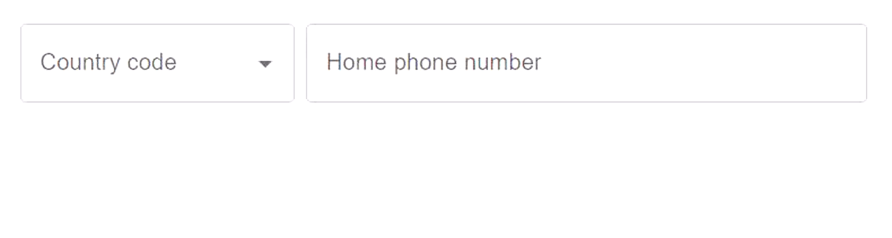

<p align="center">
   
</p>

# mui-country-code-selector

The MUI Country Code Selector (MCCS) is the best way to add a phone number input with a country code selector to your [MUI](https://mui.com/material-ui/) form. It is built on MUI's [Autocomplete](https://mui.com/material-ui/react-autocomplete/) and [TextField](https://mui.com/material-ui/react-text-field/) components, and it can be [customized](https://mui.com/material-ui/customization/how-to-customize/) by passing props to the underlying components. The API is intended to follow MUI's [API style](https://mui.com/material-ui/guides/api/) and allow the use of its customization features, but since the component is still a work in progress, not all features have been implemented yet. The MCCS can be used as a controlled or an uncontrolled component. It validates the input accepting only numbers and visual separator characters (whitespace and hyphen) as a phone number, and the display of the validation errors can be customized. As the MCCS consists of two separate input elements (country code selector and phone number input), it provides props that can be used for wrapping the subcomponents in different ways to fit them to the layout. By default the filtering of options is done using the MUI Autocomplete's filtering function, but it can be improved with external libraries, such as [match-sorter](https://github.com/kentcdodds/match-sorter).

See the interactive [demo-page]() and the [API documentation]() for more information.

## Installation

```
npm install mui-country-code-selector
```

## Composite components

The easiest way to use the MCCS is to use a ready-made composite component, which, as the name suggests, is a _composite_ of the [`CountryCodeSelector`]() component and the [`TextField`]() component. The latter functions as the actual phone number input, while the former implements the country code selector. The `CountryCodeSelectorComposite` component adds the state between these subcomponents that glues them together. Another way to use the MCCS, is to implement a custom component with the provided [Zustand](https://github.com/pmndrs/zustand) [store]() that contains the state variables and actions required to implement custom phone number input components.

There are currently two versions of the composite component: [`CountryCodeSelectorCompositeZustand`]() and [`CountryCodeSelectorCompositeReact`](). These differ in terms of the state-management solution used. The former uses Zustand to keep the state, while the latter uses React's own state-management utilities. Both versions offer the same [API](), so in principle either may be used. Currently the default import is the Zustand version, and it can be imported like this:

```
import { CountryCodeSelectorComposite } from 'mui-country-code-selector';
```

The specific versions can be imported like this:

```
import { CountryCodeSelectorCompositeReact } from 'mui-country-code-selector';

// or

import { CountryCodeSelectorCompositeZustand } from 'mui-country-code-selector';
```

The project started as an experiment in React state management, and as an attempt to learn to use the Zustand library. That is why the implementations are currently heavily based on the way a Zustand store is used. While Zustand is a great library, it creates an unnecessary dependency. Because of this, the likely future direction is to develop a more optimized and easier to read version of the `CountryCodeSelectorCompositeReact` using React's `useReducer` and `useContext` hooks, and make it the primary (and perhaps the only) version of the component.

### Basic usage

#### As a controlled component

Composite country code selector components can be used as [controlled or uncontrolled](https://react.dev/learn/sharing-state-between-components#controlled-and-uncontrolled-components) components. When the component is used as a controlled component, it is
passed a _value_ and a _change handler_ as props. In the code below, the `phoneNumValue` is a state variable that is passed to the component as the component's value which represents the phone number (including the country code), and the `phoneOnChange` is a change event handler, i.e., a
function that changes the value when a change event is triggered.

```
<CountryCodeSelectorComposite
  value={phoneNumValue}
  onChange={phoneOnChange}
  layout="gridItems"
/>
```

#### Layout wrappers

Composite components have a few different [layout-wrappers](#layout-wrappers), which define how the selector and phone number input are laid out in the HTML. The wrapper can be selected with the `layout` prop. If the component is placed on a form that is already laid out with a MUI [Grid](https://mui.com/material-ui/react-grid/), the easiest way to add the composite component is probably to use the `gridItems` wrapper, which wraps the subcomponents in Grid `item` elements.

Please see the interactive [demo and documentation page]() and [API documentation]() for more information about the layout wrappers.

#### As an uncontrolled component

When the component is used as an uncontrolled component, it is passed a React [ref](https://react.dev/learn/referencing-values-with-refs), which is then set to point to the phone number input element of the composite component. The value of the component can then be accessed through this ref.

```
<CountryCodeSelectorComposite
  inputRef={homePhoneNumRef}
  layout="gridItems"
/>
```

#### Default value

When the component is used as a controlled component, its default value can be set just by setting the initial value of the state variable, that is controlling the component's value. The default value of an uncontrolled component, however, is set using the `defaultValue` prop.

### Setting the labels and other tweaks

The composite component [API]() provides many props that allow you to customize the appearance and functionality of these components. For example, the labels of the country code selector and phone number input subcomponents can be set with `countryCodeLabel` and `phoneNumberLabel` props. Since MUI components are quite flexibly customizable using props, all subcomponents and layout components can be customized by passing props to them using `CountryCodeSelectorComposite`'s [props](). It is possible, for example, to customize rendering of the selector autocomplete's input component and option list, or the way the options are filtered. Composite components have also some convenience props that allow, for example, the changing of the variant of both the country code selector's and phone number input's underlying TextField component in one go.

Please see the [documentation page](), [API documentation](), and also the documentation of MUI's [`Autocomplete`]() and [`TextField`]() components for more information about customization of the MCCS.

## Implementing a custom component

The implementation of the component relies currently heavily on a Zustand store that contains the state variables and actions required to create a composite MCCS component. Using the store with suitable selector and text input components it is possible to implement custom MCCS components. See the [documentation page]() for more information about how to implement custom MCCS components.

## Future development

As stated above, the probable future direction is to develop an improved version of the composite component without the use of external state-management library and possibly also to switch to use the composite component as the only way of using the component. This would lead to deprecation of the Zustand store and, for example, `CountryCodeSelector` from the public API. At the same time, the intention is to keep the API as stable as possible.

Before tackling the new composite component implementation, there are a few things to add. The API is still missing some props, such as [form attributes](https://mui.com/material-ui/react-text-field/#form-props) and MUI's TextField component's [size](https://mui.com/material-ui/api/text-field/#text-field-prop-size) and [margin](https://mui.com/material-ui/api/text-field/#text-field-prop-margin) props. It should also be possible to use selector's and input component's [`onChange`](https://mui.com/material-ui/api/text-field/#text-field-prop-onChange) and [`value`](https://mui.com/material-ui/api/text-field/#text-field-prop-value) props through `selectorProps` and `inputProps`. MUI's [styled()](https://mui.com/system/styled/) function does not currently work with composite components. Some tests must also be added, e.g., to test the reset handler. The country data must be checked and brought into compliance with the ISO 3166 standard, and the component should be localizable to different languages.
